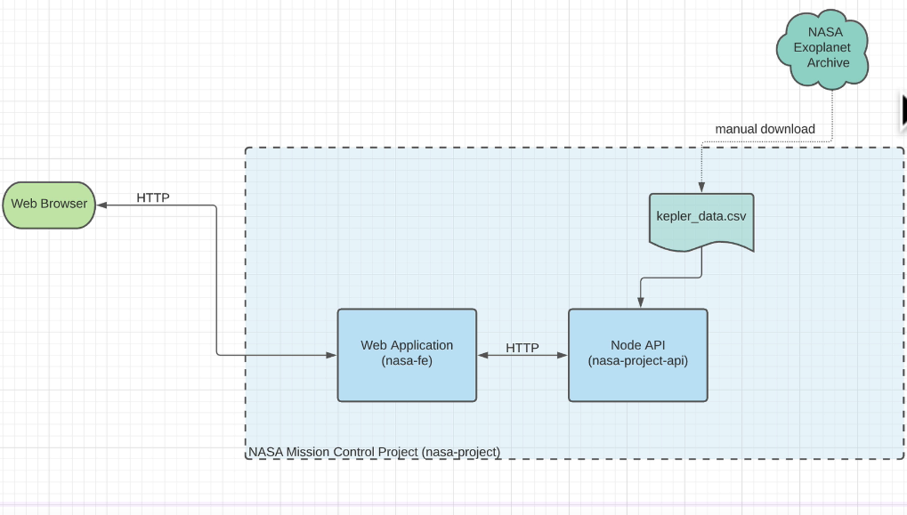
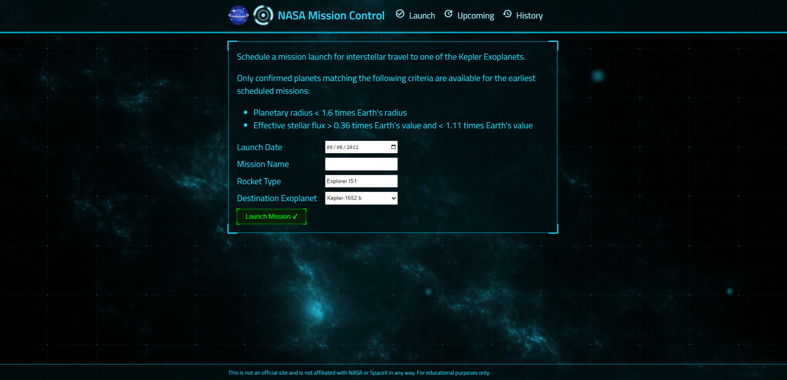
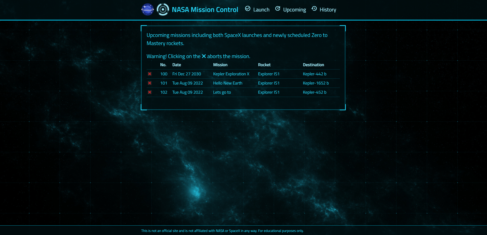
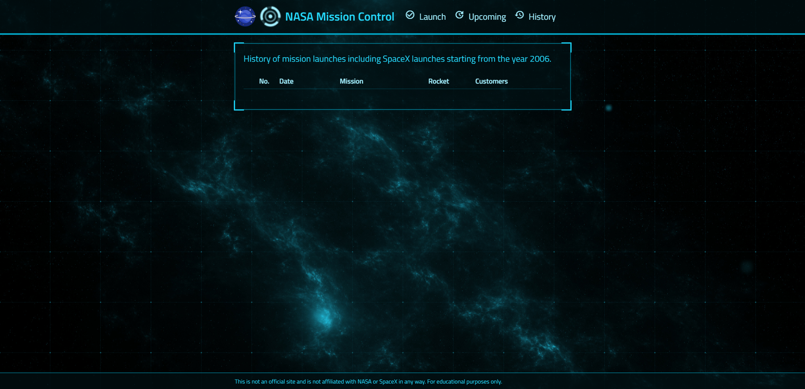

<div align="center">
<h1 align="center">NASA-project</h1>
<p align="left">This is a Full Stack application proposed by Zero to Mastery where I built an API that manages NASA launches to another planets. Is possible to see history of all launches, post new launches and delete launches by id.
This is a study purpose application where I applied the MVC model.
</p>


</div>

<h2>💻 Technologies</h2>

<div>
    <bl>
    <li>
    <a href="https://pt-br.reactjs.org/">
    ReactJs
    </a>
    </li>
    <li>
    <a href="https://nodejs.org/en/">
    NodeJS
    <ol>
    <li>
    <a href="http://expressjs.com/pt-br/">Express</a>
    </li>
    </ol>
    </a>
    </li>
    </bl>
</div>

## 🧰 Installation

1. Clone the repository and install dependencies:

   ```bash
   $ git clone git@github.com:Felipe1496/NASA-project.git
   $ cd NASA-project
   $ npm install
   ```

2. To run the project in production mode, run:

   ```bash
   $ npm run deploy
   ```

<h2>📷 Screenshots</h2>




